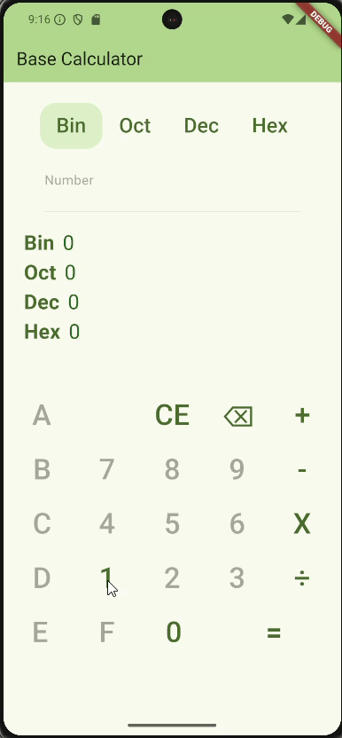
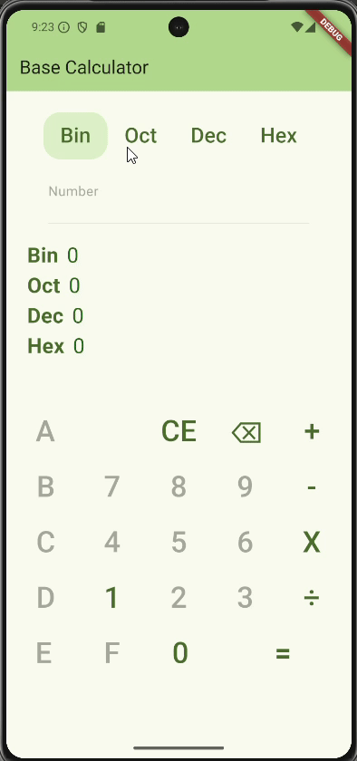
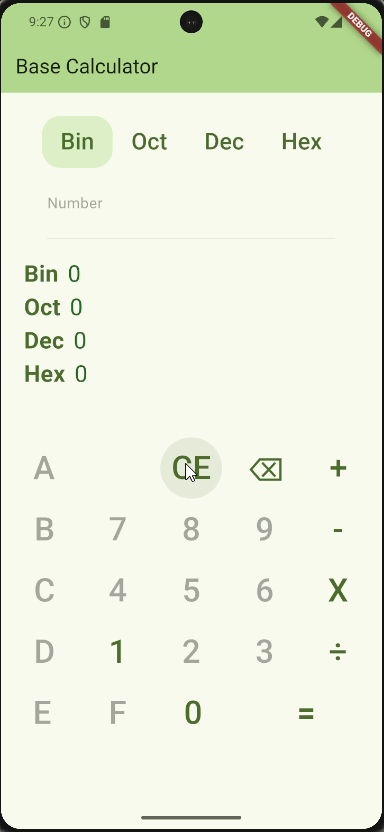
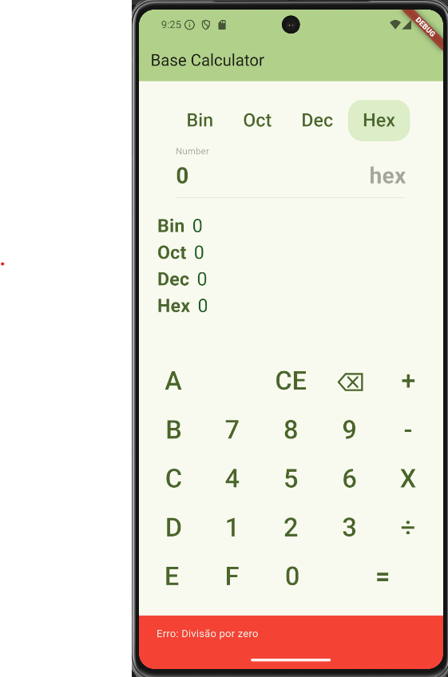

# 📟 Base Calculator

A **Base Calculator** é uma aplicação Flutter que permite converter números entre diferentes bases numéricas (Binário, Octal, Decimal e Hexadecimal), bem como realizar operações aritméticas básicas (adição, subtração, multiplicação e divisão) nessas bases.

## ✨ Funcionalidades

* Conversão instantânea entre:
    * Binário (base 2)
    * Octal (base 8)
    * Decimal (base 10)
    * Hexadecimal (base 16)



* Interface intuitiva para introdução de números e operações
* Validação automática dos dados introduzidos com base na base selecionada



* Operações disponíveis: `+`, `-`, `X`, `÷`



* Suporte visual para diferentes bases com destaques dinâmicos
* Mensagens de erro amigáveis (ex: divisão por zero, dados inválidos)


## 🚀 Como correr a aplicação

1. Certifica-te de que tens o [Flutter](https://flutter.dev/docs/get-started/install) instalado.
2. Clona este repositório:

``` bash
git clone https://github.com/RikiMouraPT/flutter-tp01.git
```

3. Navega até à pasta do projeto:

``` bash
cd flutter-tp01
```

4. Corre a aplicação:

``` bash
flutter run
```

## 🛠️ Estrutura principal

* `main.dart`: Contém toda a lógica e interface da aplicação.
* `fromController`: Controlador de texto que guarda a entrada do utilizador.
* `calculate()`: Converte o número inserido nas diferentes bases.
* `operationPressed()`, `evaluate()`: Funções responsáveis pelas operações aritméticas.

## 📂 To-do (futuro)

* Suporte para números negativos
* Histórico de operações
* Animações e transições mais suaves
* Temas personalizados